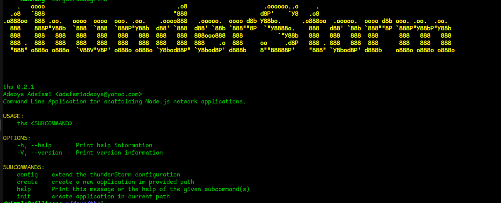

# What we are building

<!--  -->

*ThunderStorm* is a command line application that can be used to quickly setup a [Node.js](https://nodejs.org/) project. It is a simple way to get a project started with having to deal with manual files and directories set up.

The following section will walk you through the process of creating the thunderStorm application
Let's get started!
